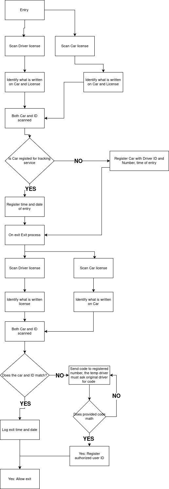

## Logic for Code

Here is the logic for the car registration software:

# TODO Find a way to read text from the license disk 
Find an generative AI that can read text from images. 

Optical Character Recognition. it has to be the following:

1. Accuracy - should be able to read the plate fairly easy
1. Cheap  - because this is a hobby, hopefully not for long lol
1. Quick - because use case is at the gate while someone waits to come in
1. Low resource usage - I do not have a quantum computer. I have 5600x,6800,SSD,32GB 3200MT DDR4 ram. Or a weak laptop which I will also try out.

Optical Character Recognition

Two choices were made. Initial attempt was [pytesserect](https://pypi.org/project/pytesseract/) a python wrapper for [Google Tesseract](https://github.com/tesseract-ocr/tesseract) installed from source and [openOCR](https://github.com/Topdu/OpenOCR)

1. Pytesserect
    1. Accuracy - not good for purpose. High amounts of false positives.
    1. Cheap - open source. 
    1. Quick - fairly quick for single use. Have not recorded duration.
    1. Low Resource usage - my computer could handle with ease
2. OpenORC

